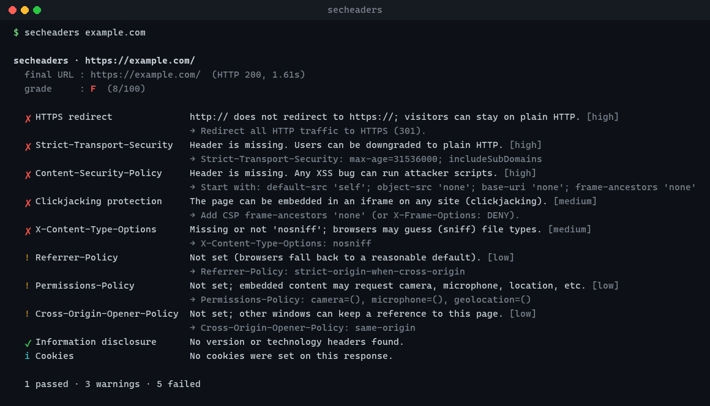

# secheaders

**Bir web sitesinin HTTP güvenlik başlıklarını kontrol eden, not veren ve nasıl düzeltileceğini söyleyen komut satırı aracı.**
*A command-line tool that checks a website's HTTP security headers, grades them and tells you how to fix them. English below.*

[](https://github.com/yusufiyilmaz/secheaders-cli/actions/workflows/tests.yml)


[](LICENSE)



## Neden yaptım?

Kendi kişisel sitemi ([yilmazyusuf.dev](https://yilmazyusuf.dev)) sertleştirirken her başlığı tek tek elle kontrol ediyordum. Bunun yerine, bir siteye saldırganın gözüyle bakan ve **neyin eksik olduğunu, neden önemli olduğunu ve nasıl düzeltileceğini** söyleyen küçük bir araç yazmak istedim.

## Ne kontrol ediyor?

| Kontrol | Neye bakıyor | Neden önemli |
|---|---|---|
| HTTPS yönlendirmesi | `http://` adresi `https://`'e gidiyor mu | Şifresiz bağlantıda trafik okunabilir/değiştirilebilir |
| `Strict-Transport-Security` | Var mı, `max-age` yeterli mi, `includeSubDomains` | HTTPS'ten HTTP'ye düşürme (downgrade) saldırıları |
| `Content-Security-Policy` | `unsafe-inline`, `unsafe-eval`, `*` gibi geniş kaynaklar, `object-src`, `base-uri` | XSS açıklarının etkisini sınırlar |
| Clickjacking | CSP `frame-ancestors` veya `X-Frame-Options` | Sitenin görünmez bir iframe'e konup tıklama çalınması |
| `X-Content-Type-Options` | `nosniff` | Tarayıcının dosya türünü tahmin edip yanlış çalıştırması |
| `Referrer-Policy` | URL sızdıran değerler (`unsafe-url`) | Başka sitelere tam adres (ve içindeki token'lar) sızması |
| `Permissions-Policy` | Var mı | Kamera, mikrofon, konum gibi özelliklerin kısıtlanması |
| `Cross-Origin-Opener-Policy` | `same-origin` | Başka pencerelerin sayfaya erişimi |
| Bilgi sızıntısı | `Server` sürümü, `X-Powered-By` | Saldırgana kullanılan yazılımın ve sürümünün söylenmesi |
| Çerezler | `Secure`, `HttpOnly`, `SameSite` | Oturum çalma, CSRF |

**Puanlama:** 100'den başlar; yüksek önemli sorun −20, orta −10, düşük −4. Not aralıkları: A+ ≥ 95, A ≥ 85, B ≥ 70, C ≥ 55, D ≥ 40, altı F.

## Kurulum ve kullanım

Python 3.9+ yeterli, **hiçbir dış kütüphane gerekmez**.

```bash
git clone https://github.com/yusufiyilmaz/secheaders-cli.git
cd secheaders-cli
pip install .
```

```bash
secheaders example.com                 # tek site
secheaders github.com example.com      # birden fazla site
secheaders example.com --json          # makine tarafından okunabilir çıktı
secheaders mysite.com --fail-under B   # not B'den kötüyse çıkış kodu 1 (CI için)
```

Kurmadan çalıştırmak için: `python -m secheaders example.com`

**Çıkış kodları:** `0` başarılı · `1` not `--fail-under` eşiğinin altında · `2` site taranamadı.

### CI'da kullanım

`--fail-under` ile, örneğin GitHub Actions'ta her yayından sonra sitenin başlıklarının bozulmadığını otomatik kontrol edebilirsiniz:

```yaml
- run: pip install git+https://github.com/yusufiyilmaz/secheaders-cli.git
- run: secheaders yilmazyusuf.dev --fail-under A
```

## Testler

```bash
python -m unittest discover -s tests -v
```

28 test var: başlık kontrolleri için çevrimdışı birim testleri, ve gerçek bir yerel HTTP sunucusuna bağlanan entegrasyon testleri (internet gerekmez).

## Proje yapısı

```text
secheaders/
  checks.py    # tüm kontroller: başlık alır, bulgu döndürür (ağ erişimi yok, kolay test edilir)
  scanner.py   # ağ tarafı: URL'yi çeker, yönlendirmeleri izler, hataları yakalar
  report.py    # renkli terminal çıktısı ve JSON
  cli.py       # komut satırı arayüzü
tests/
```

Kontroller (`checks.py`) ağdan tamamen ayrı tutuldu; bu sayede her kural birkaç satırlık testle doğrulanabiliyor.

## Sınırlamalar

- Sadece **yanıt başlıklarına** bakar; sayfanın içeriğini veya JavaScript'i incelemez.
- CSP kontrolü yaygın hataları yakalar, ama her politikayı tam olarak değerlendiremez (örn. `strict-dynamic` ayrıntıları).
- Tek bir isteğe bakar; farklı sayfalarda farklı başlıklar olabilir.

## Yol haritası

- [ ] Birden fazla sayfayı tarama
- [ ] TLS sürümü ve sertifika süresi kontrolü
- [ ] HTML rapor çıktısı

## Sürümler ve güvenlik

Değişiklikler [CHANGELOG.md](CHANGELOG.md) dosyasında. Araçta bir güvenlik açığı bulursanız lütfen [SECURITY.md](SECURITY.md)'deki adımları izleyin.

## Etik kullanım

Bu araç yalnızca normal bir tarayıcının yaptığı gibi tek bir sayfa ister; saldırı yapmaz. Yine de **yalnızca sahibi olduğunuz veya test etme izniniz olan siteleri** tarayın.

---

## English

`secheaders` fetches a URL, follows redirects and checks its HTTP security headers: HTTPS redirect, HSTS, CSP (`unsafe-inline`, `unsafe-eval`, wildcard sources, missing `object-src` / `base-uri`), clickjacking protection, `X-Content-Type-Options`, `Referrer-Policy`, `Permissions-Policy`, COOP, version disclosure and cookie flags. Each finding comes with a severity and a concrete fix, and the site gets a grade from A+ to F.

```bash
pip install .
secheaders example.com
secheaders example.com --json
secheaders mysite.com --fail-under B   # exit code 1 if the grade is worse than B
```

No third-party dependencies (Python 3.9+). Run the tests with `python -m unittest discover -s tests`. Only scan sites you own or are allowed to test.

**License:** MIT
